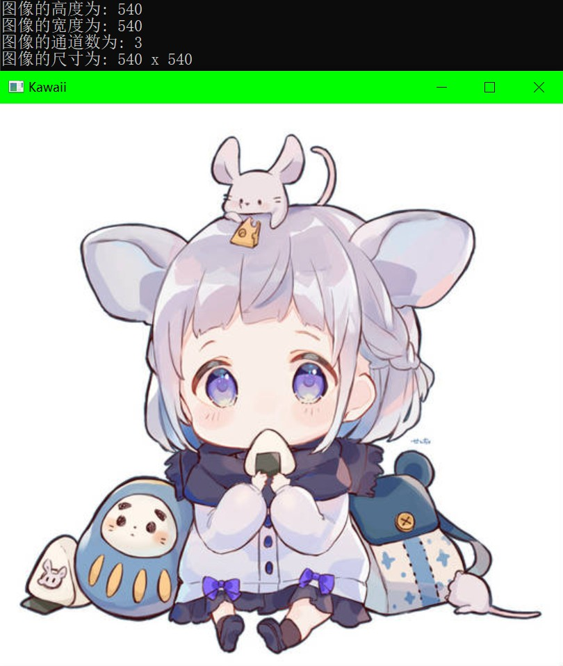

# Mat创建图像(矩阵),获取图像信息,感兴趣区域(Rect)

## 创建图像(矩阵) : Mat

创建一个大小为0的图像(矩阵)

`cv::Mat image;`

使用构造函数

`cv::Mat image(100,100,CV_8U);`

矩阵的行列数,数据类型.

常用的数据类型:

- `CV_8U`: 8为无符号型(0~255),即灰度图.
- `CV_8UC3`: 三通道8位无符号型,三通道为BGR,与matlab中RGB正好相反.

`cv::Mat image(100,100,cv_8U,100);`

第四个参数为初始值.

另一种写法`cv::Mat image(100,100,cv_8U,Scalar(100));`

对于三通道图像

`cv::Mat image(100,100,cv_8UC3,Scalar(100,100,100));`

## 获取图像数据

示例程序

``` cpp {.line-numbers}
#include <opencv2/opencv.hpp>
#include <iostream>

#define LOG(x) std::cout << x << '\n'

int main()
{
    cv::Mat image = cv::imread("./img/kawaii.jpg");

    if (image.empty())
    {
        LOG("Read Image file Failed!");
    }

    cv::imshow("Kawaii", image);

    LOG("图像的高度为: " << image.rows); // 矩阵的行数
    LOG("图像的宽度为: " << image.cols); // 矩阵的列数
    LOG("图像的通道数为: " << image.channels()); // 图像色彩通道数
    LOG("图像的尺寸为: " << image.size); // 行数 * 列数

    cv::waitKey(0);

    return 0;
}
```



## 感兴趣区域

图像的原点在左上角

``` cpp {.line-numbers}
cv::Mat imageKeen(image, cv::Rect(0, 0, 270, 270));

cv::imshow("Kawaii", imageKeen);
```

`cv::Rect`:感兴趣矩阵起点(行列起点),感兴趣矩阵终点(行列终点)


