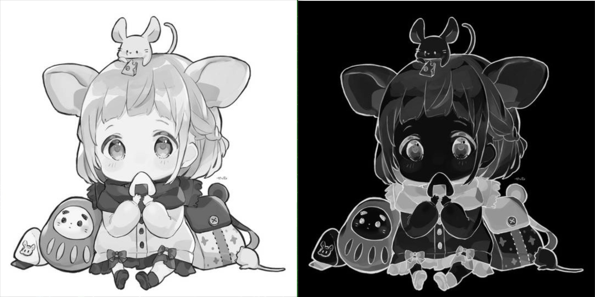
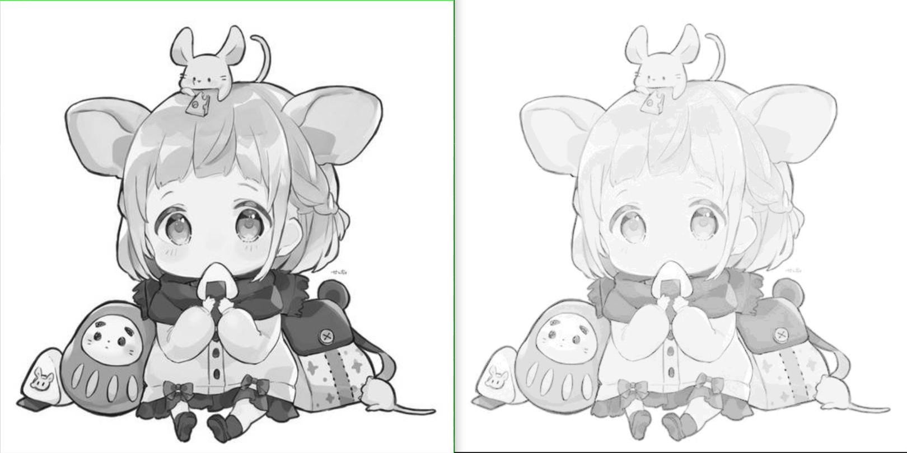
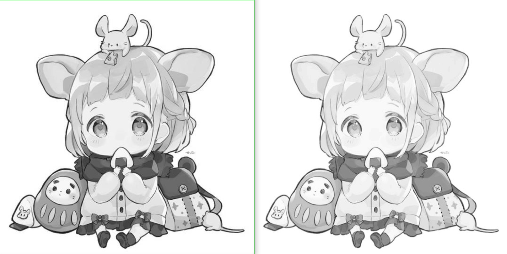

# 灰度变换(灰度反转,对数变换,幂律变换)

## 灰度变换原理

通过变换函数T将原图像像素灰度值r映射为灰度值s.

$s = T(r)$

### 灰度反转

原理: 将图像亮暗对调,可以增强图像中暗色区域细节

$s = T(r) = L - 1 - r$

其中L为图像的灰度级,0~255灰度图像的灰度级为256.

### 代码实现

``` cpp {.line-numbers}
int main()
{
  cv::Mat image_in, image_out, image_gray;
  image_in = cv::imread("./img/kawaii.jpg");

  if (image_in.empty())
  {
      LOG("Load Image Error!");
      return -1;
  }

  cv::cvtColor(image_in, image_gray, cv::COLOR_BGR2GRAY);
  cv::imshow("image_gray", image_gray);

  image_out = image_gray.clone();

  for (int i = 0; i < image_gray.rows; i++)
  {
      for (int j = 0; j < image_gray.cols; j++)
      image_out.at<uchar>(i, j) = 255 - image_gray.at<uchar>(i, j);
  }

  cv::imshow("image_out",image_out);

  cv::waitKey(0);

  return 0;
}
```



`cv::cvColor(InputArray src,OutputArray dst,int code, int dstCn = 0);`

它可以将一个图像从一种颜色空间转换为另一种颜色空间.

参数解释:

- `src`: 输入图像.
- `dst`: 输出图像.
- `code`: 颜色空间转换代码.
  - `cv::COLOR_BGR2GRAY`: 将BGR图像转换为灰度图像.
  - `cv::COLOR_BGR2RGB`: 将BGR彩色图像转换为RGB彩色图像.
  - `cv::COLOR_GRAY2BGR`: 将灰度图转换为BGR彩色图像.
- `dstCn`: 输出图像的通道数,默认为0,表示与输入相同.

### 应用

- 图像增强: 增强较亮与较暗处的细节.
- 特殊的艺术效果.
- 在一些特殊的图像处理算法中,将图像进行灰度反转可以提高目标辨识度.

## 对数变换

扩展图像中的暗像素值,压缩高灰度值.

$s = T(r) = c * log(1 + r)$

### C++代码实现

``` cpp {.line-numbers}
int main()
{
    cv::Mat image_in, image_out, image_gray;
    image_in = cv::imread("./img/kawaii.jpg");

    if (image_in.empty())
    {
        LOG("Load Image Error!");
        return -1;
    }

    cv::cvtColor(image_in, image_gray, cv::COLOR_BGR2GRAY);
    cv::imshow("image_gray", image_gray);

    image_out = image_gray.clone();

    for (int i = 0; i < image_gray.rows; i++)
    {
        for (int j = 0; j < image_gray.cols; j++)
            image_out.at<uchar>(i, j) = 6 * log((double)(image_gray.at<uchar>(i, j)) + 1);
    }

    cv::normalize(image_out, image_out, 0, 255, cv::NORM_MINMAX); // 图像归一化,转换到0 ~ 255
    cv::convertScaleAbs(image_out, image_out);
    cv::imshow("image_out", image_out);

    cv::waitKey(0);

    return 0;
}
```



### 函数详解

- 对数变换数学表达式
  - `c`: 是一个常量,是调节参数;案例中为6.
  - `r`: 输入图像的像素值.
  - `s`: 输出图像的像素值.
  - `+ 1`: 避免对数函数应用于0值.
- `void cv::log(InputArray src, OutputArray dst);`
  - `src`: 输入数组,可以是`float`或`double`
  - `dst`: 输出数组,与输入相同.

### 应用场景

- 提升低亮度细节,压缩高亮度部分.

## 幂律变换(伽马变换)

$s = T(r) = c * r^\gamma$

- $\gamma < 1$: 增强较暗区域的细节,减小对比度
- $\gamma > 1$: 增强较亮区域的细节,增大对比度.

``` cpp {.line-numbers}
int main()
{
  // Gamma Transform
  cv::Mat image_in, image_out, image_gray;
  image_in = cv::imread("./img/kawaii.jpg");

  if (image_in.empty())
  {
    LOG("Load Image Error!");
    return -1;
  }

  cv::cvtColor(image_in, image_gray, cv::COLOR_BGR2GRAY);
  cv::imshow("image_gray", image_gray);

  image_out = image_gray.clone();

  for (int i = 0; i < image_gray.rows; i++)
  {
    for (int j = 0; j < image_gray.cols; j++)
    image_out.at<uchar>(i, j) = 6 * pow((double)image_gray.at<uchar>(i, j), 0.5);
  }

  cv::normalize(image_out, image_out, 0, 255, cv::NORM_MINMAX);
  cv::convertScaleAbs(image_out, image_out);
  cv::imshow("image_out", image_out);

  cv::waitKey(0);

  return 0;
}
```



### 函数

- `void cv::convertScaleAbs(InputArray src,OutputArray dst,double alpha = 1.0, double beta = 0.0);`
  - 将每个像素值乘`alpha`,加上`beta`
  - 对线性变换后的结果取绝对值
  - 对绝对值进行类型转换,将浮点类型转换为无符号整形(`CV_8U`)
- `void cv::pow(InputArray src,double power,OutputArray dst);`
  - `src`: 输入图像,单多通道都可.
  - `power`: 幂函数指数.
  - `dst`: 输出,与输入相同.
