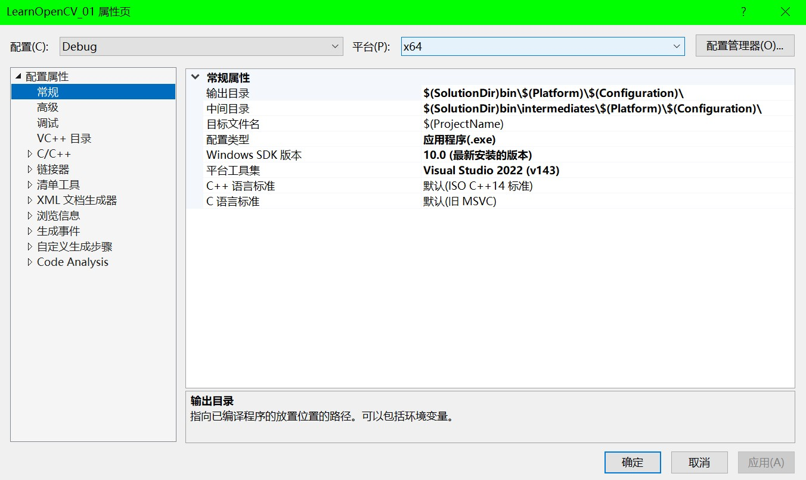
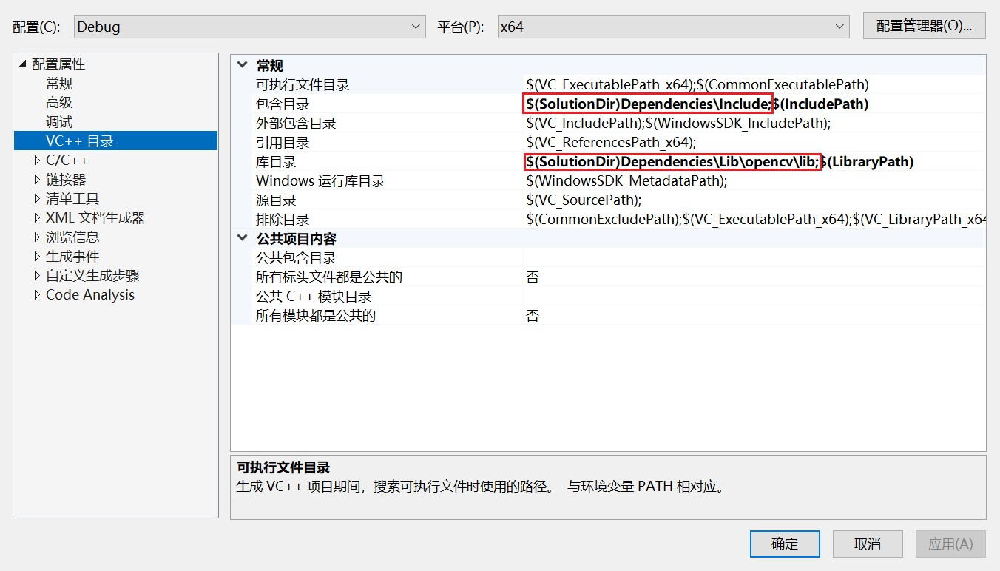
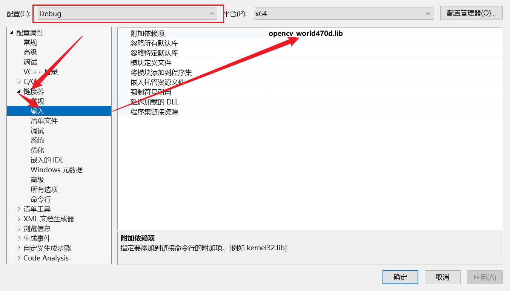
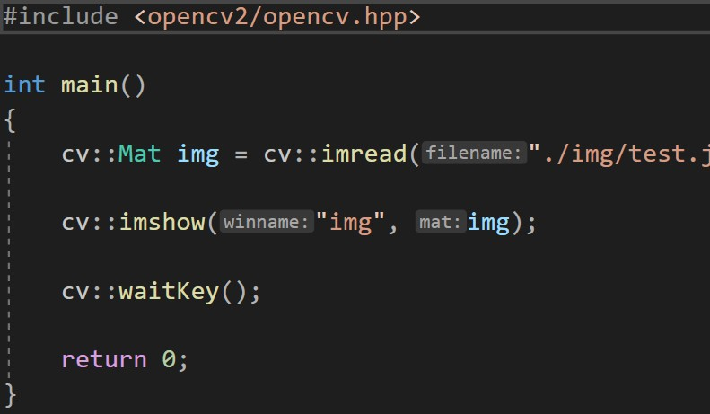

# 环境配置

## 参考资料

环境配置参考地址 : [visual studio2019配置opencv（详细教程）升级版](https://zhuanlan.zhihu.com/p/597239412)

本笔记学习是使用的是**VS2022**,**OpenCV4.7.0**

## 工具下载

[VS2022](https://visualstudio.microsoft.com/zh-hans/vs/)

## OpenCV下载

[OpenCV4.7.0](https://opencv.org/releases/)

- `exe`文件下载: 安装静态与动态库,可直接链接到VS
- `Source`: 需要自己编译

这里我们使用`exe`文件进行下载与配置

## 工程配置

### 新建空项目

### 项目配置

这里的配置参考的是[The Cherno](https://www.youtube.com/@TheCherno)的C++教程.

### 第三方库配置

包含目录为opencv下的**build\include**

库目录为opencv下的**build\x64\vc16\lib**

Debug模式下对应**opencv_world470d.lib**

Release模式下对应**opencv_world470.lib**

### 测试

生成无问题,但我们运行时会提示我们缺少dll文件,因为我们使用的是动态链接,此时我们找到*OpenCV\opencv\build\x64\vc16\bin*目录下的对应*dll*文件,把它丢在我们的*exe*文件边上就好.

运行程序,我们成功显示了一张图片.

